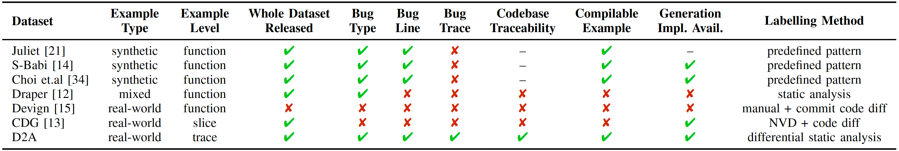
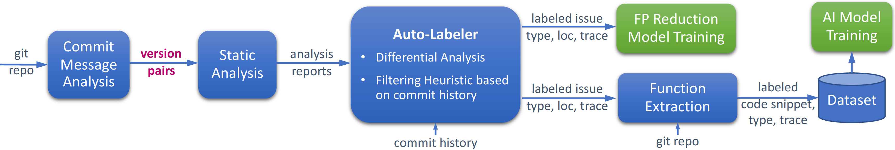

# D2A Dataset and Generation Pipeline

This repository is to support contributions for tools and new data entries for the D2A dataset hosted in DAX

The goal of this dataset is to create a unique, publicly available, open for contributions, code vulnerability dataset to foster new research in this field. Existing datasets are not very transparent on their labeling methods, nor their data acquisition methods, some are synthetic and too simplistic, none offers data beyond the vulnerable function. We expect to improve and open the field of research in this space.

## Table of Contents
* [Introduction](#introduction)
    - [Why D2A?](#why-d2a)
    - [Differential Analysis and D2A Dataset Generation Pipeline](#differential-analysis-and-d2a-dataset-generation-pipeline)
        - [Intuition](#intuition)
        - [Components](#components)
* [Downloading the D2A Dataset and the Splits](#downloading-the-d2a-dataset-and-the-splits)
* [Dataset Description](#dataset-description)
* [Using the Dataset](#using-the-dataset)
* [Annotating More Projects](#annotating-more-projects)
* [D2A Paper and Citation](#d2a-paper-and-citation)

## Introduction

D2A is a differential analysis based approach to label issues reported by static analysis tools as ones that are more likely to be true positives and ones that are more likely to be false positives. Our goal is to generate a large labeled dataset that can be used for machine learning approaches for code understanding and vulnerability detection.

### Why D2A?

Given programs can exhibit diverse behaviors, training machine learning models for code understanding and vulnerability detection requires large datasets. However, according to [a recent survey](https://ieeexplore.ieee.org/document/9108283), lacking good and real-world datasets has become a major barrier for this field. Many existing works created self-constructed datasets based on different criteria and only a few fully released their datasets. We compare popluar publically available datatsets for vulnerablity detection tasks as follows



Note: Because there is no oracle, there is no perfect dataset that is large enough and has 100% correct labels for AI-based vulnerability detection tasks. Datasets generated from manual reviews have better quality labels in general. However, limited by their nature, they are usually not large enough for model training. On the other hand, the quality of the D2A dataset is bounded by the capacity of static analysis. D2A can produce large datasets with better labels comparing to the ones labeled solely by static analysis, and complement existing high-quality datasets.

### Differential Analysis and D2A Dataset Generation Pipeline 

#### Intuition

For projects with commit histories, we assume some commits are code changes that fix bugs. We run static analysis on the versions before and after such commits. If some issues detected in a before-commit version disappear in the corresponding after-commit version, they are very likely to be real bugs that got fixed by the commit. If we analyze a large number of consecutive version pairs and aggregate the results, some issues found in a before-commit version never disappear in an after-commit version. We say they are not very likely to be real bugs because they were never fixed. Then, we de-duplicate the issues found in all versions and adjust their classifications according to the commit history. Finally, we label the issues that are very likely to be real bugs as positives and the remaining ones as negatives.

#### Components

The following figure shows the overview of the D2A dataset generation pipeline.



* **Commit Message Analysis** ([scripts/infer_pipeline/commit_msg_analyzer](scripts/infer_pipeline/commit_msg_analyzer)) analyzes the commit messages and identifies the commits that are more likely to refer to vulnerability fixes. 

* **Pairwise Static Analysis** ([scripts/infer_pipeline](scripts/infer_pipeline)) run the analyzer on the before-commit and after-commit versions for each selected commit hashes obtained in the previous step

* **Auto-labeler** ([scripts/auto_labeler](scripts/auto_labeler)) merges the analysis results for all selected commit versioins and label each issue based on differential logic and commit history heuristics. 

* **Function Extractor** ([scripts/dataset_generator](scripts/dataset_generator)) extracts the bodies of the functions involved in the trace. There are two types of samples: 

    1) Samples based on static analyzer outputs. Such samples are all analyzed by the static analyzer. They are positive issues according to the static analyzer and have bug traces. We extract the functions mentioned in the trace together with other information and assign the auto-labeler labels to them. Please refer to Sec.III-C in the [D2A paper](#paper) for details. 

    2) Samples from fixed version. Such samples are not directly from static analysis results because they are "fixed" and thus not reported by the analyzer. Instead, given samples with positive auto-labeler labels in the *before-fix* version, we extract the corresponding functions in the *after-fix* version and label them 0. More information can be found in the Sec.III-D in the [D2A paper](#paper).


## Downloading the D2A Dataset and the Splits

The D2A dataset and the global splits can be downloaded from [IBM Data Asset eXchange](https://developer.ibm.com/exchanges/data/all/d2a/). 

The latest version is `v1.0.0`.

## Dataset Description

Details could be found in [Dataset Description and Stats](docs/dataset_stats.md).

## Using the Dataset

Please refer to [Dataset Usage Examples](docs/dataset_usage.md) for details.

## Annotating More Projects

Please refer to [Running the Dataset Generation Pipeline](docs/pipeline.md).

## D2A Paper and Citation

### Paper
 
D2A: A Dataset Built for AI-Based Vulnerability Detection Methods Using Differential Analysis 

[[ICSE-SEIP'21 Website]](https://conf.researchr.org/details/icse-2021/icse-2021-Software-Engineering-in-Practice/28/D2A-A-Dataset-Built-for-AI-Based-Vulnerability-Detection-Methods-Using-Differential-)  [[PDF]](docs/assets/D2A_paper.pdf)


### Citation

Please cite the following paper, if the D2A dataset or generation pipeline is useful for your research.

```bibtex
@inproceedings{D2A,
  author = {Zheng, Yunhui and Pujar, Saurabh and Lewis, Burn and Buratti, Luca and Epstein, Edward and Yang, Bo and Laredo, Jim and Morari, Alessandro and Su, Zhong},
  title = {D2A: A Dataset Built for AI-Based Vulnerability Detection Methods Using Differential Analysis},
  year = {2021},
  publisher = {Association for Computing Machinery},
  address = {New York, NY, USA},
  series = {ICSE-SEIP '21},
  booktitle = {Proceedings of the ACM/IEEE 43rd International Conference on Software Engineering: Software Engineering in Practice}
}
```
<a href="https://www.web-stat.com"></a>
