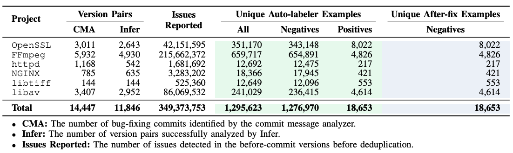

# Sample Description and Dataset Stats

The current dataset contains the samples generated from 6 open-source projects, namely, `OpenSSL`, `FFmpeg`, `HTTPD`, `NGINX`, `Libtiff`, and `Libav`. 

For each project, there are 3 `pickle.gz` files like `nginx_after_fix_extractor_0.pickle.gz`, `nginx_labeler_1.pickle.gz`, and `nginx_labeler_0.pickle.gz`, which are generated by two slightly different extractors (see [Sample Types](../README.md##sample-types)).

Each `pickle.gz` file contains compressed samples in JSON (e.g. [auto_labeler_0.json](samples/auto_labeler_0.json) and we will use this example to explain the sample fields in the following table). Please refer to [Viewing the Samples in Pickle Files](dataset_usage.md#viewing-the-samples-in-pickle-files) and see how to read the samples in `pickle.gz` files.

## Sample Description

 dataset files are compressed JSON in the pickle

<table>
    <tr>
      <th width="200px">Field</th>
      <th>Description</th>
    </tr>
    <!-- row -->
    <tr>
      <td style="vertical-align:top"> <a href="samples/auto_labeler_0.json#L2" target="_blank">id</a> </td>
      <td> sample id in the shape of <code>project_hash_label</code>. </td>
    </tr>
    <tr>
      <td style="vertical-align:top"> <a href="samples/auto_labeler_0.json#L3" target="_blank">label</a> </td>
      <td> Possible values are <code>1</code> or <code>0</code>:
        <ul style="margin-left: 5px; margin-top: 0px; margin-bottom: 0px; padding-left: 15px;">
            <li> <code>1</code> - the sample is a true positive according to the differential analysis (e.g. <a href="samples/auto_labeler_1.json#L3" target="_blank">auto-labeler_1.json</a>).</li>
            <li> <code>0</code> - the sample is a false positive (e.g. <a href="samples/auto_labeler_0.json#L3" target="_blank">auto-labeler_0.json</a>).</li>
        </ul>
      </td>
    </tr>
    <!-- row -->
    <tr>
      <td style="vertical-align:top"> <a href="samples/auto_labeler_0.json#L4" target="_blank">label_source</a> </td>
      <td> Possible values are <code>auto_labeler</code> and <code>after_fix_extractor</code>:
          <ul style="margin-left: 5px; margin-top: 0px; margin-bottom: 0px; padding-left: 15px;">
              <li><code>auto_labeler</code> – Samples are generated and labeled based on the differential analysis using static analyzer (e.g., <a href="samples/auto_labeler_0.json#L4" target="_blank">auto-labeler_0.json</a>).  Please refer Sec III.C in the <a href="https://arxiv.org/abs/2102.07995"  target="_blank">D2A paper</a> for details</li>
              <li><code>after_fix_extractor</code> – Given an issue whose label is <code>1</code> in the <i>before-fix</i> version, extract the corresponding snippets in the <i>after-fix</i> version (e.g., <a href="samples/after_fix_0.json#L4" target="_blank">after_fix_0.json</a>). Please refer Sec. III.D in the <a href="https://arxiv.org/abs/2102.07995"  target="_blank">D2A paper</a> for details.</li>
          </ul>
      </td>
    </tr>
    <!-- row -->
    <tr>
      <td style="vertical-align:top"> <a href="samples/auto_labeler_0.json#L5" target="_blank">bug_type</a> </td>
      <td>Bug type identified by Infer static analyzer. The list of all Infer issue types can be found in <a href="https://fbinfer.com/docs/all-issue-types" target="_blank">here</a>.
      </td>
    </tr>
    <!-- row -->
    <tr>
      <td style="vertical-align:top"> <a href="samples/auto_labeler_0.json#L6" target="_blank">project</a> </td>
      <td>Open-source project mined.</td>
    </tr>
    <!-- row -->
    <tr>
      <td style="vertical-align:top"> <a href="samples/auto_labeler_0.json#L7-L14" target="_blank">bug_info</a> </td>
      <td>Bug details provided by static analyzers like Infer. This field is <code>null</code> for <code>after_fix_extractor</code> samples because such they are not based on static analyzer reports.</td>
    </tr>
    <!-- row -->
    <tr>
      <td style="vertical-align:top"> &#9504; <a href="samples/auto_labeler_0.json#L8" target="_blank">qualifier</a> </td>
      <td>Further violation description depending on the <code>bug_type</code> </td>
    </tr>
    <!-- row -->
    <tr>
      <td style="vertical-align:top"> &#9504; <a href="samples/auto_labeler_0.json#L9" target="_blank">file</a> </td>
      <td> File in project where bug was found </td>
    </tr>
    <!-- row -->
    <tr>
      <td style="vertical-align:top"> &#9504; <a href="samples/auto_labeler_0.json#L10" target="_blank">procedure</a> </td>
      <td> Containing function </td>
    </tr>
    <!-- row -->
    <tr>
      <td style="vertical-align:top"> &#9504; <a href="samples/auto_labeler_0.json#L11" target="_blank">line</a> </td>
      <td> Line number in file </td>
    </tr>
    <!-- row -->
    <tr>
      <td style="vertical-align:top"> &#9504; <a href="samples/auto_labeler_0.json#L12" target="_blank">column</a> </td>
      <td> Column number in line of the bug </td>
    </tr>
    <!-- row -->
    <tr>
      <td style="vertical-align:top"> &#9504; <a href="samples/auto_labeler_0.json#L13" target="_blank">url</a> </td>
      <td> The URL to the bug location on Github  </td>
    </tr>
    <!-- row -->
    <tr>
      <td style="vertical-align:top"> <a href="samples/auto_labeler_0.json#L15" target="_blank">adjusted_bug_loc</a> </td>
      <td>
       For <code>before-fix</code> example, it points to the buggy step in the trace. For <code>after-fix</code> examples, it's <code>null</code>, because there is no bug report for <code>after-fix</code> examples. Instead, <code>after-fix</code> examples were generated based on <code>before-fix</code> examples. Please see <a href="https://github.com/IBM/D2A#sample-types" target="_blank">Sample Types</a> for details.
      </td>
    </tr>
    <!-- row -->
    <tr>
      <td style="vertical-align:top"> &#9504; <code>file</code> </td>
      <td> File in project where bug was found  </td>
    </tr>
    <!-- row -->
    <tr>
      <td style="vertical-align:top"> &#9504; <code>line</code> </td>
      <td> Line number in file of the bug  </td>
    </tr>
    <!-- row -->
    <tr>
      <td style="vertical-align:top"> &#9504; <code>column</code> </td>
      <td> Column number in line of the bug  </td>
    </tr>
    <!-- row -->
    <tr>
      <td style="vertical-align:top"> &#9504; <code>url</code> </td>
      <td> The URL to the bug location on Github  </td>
    </tr>
    <!-- row -->
    <tr>
      <td style="vertical-align:top"> <a href="samples/auto_labeler_0.json#L16" target="_blank">bug_loc_trace_index</a> </td>
      <td>
      When <code>adjusted_bug_loc</code> is not null, this is the index of the corresponding step in the trace (the list in the <code>trace</code> field). When <code>adjust_bug_loc</code> is null, this field is <code>null</code> too 
      </td>
    </tr>
    <!-- row -->
    <tr>
      <td style="vertical-align:top"> <a href="samples/auto_labeler_0.json#L17-L20" target="_blank">versions</a> </td>
      <td> Related project git versions </td>
    </tr>
    <!-- row -->
    <tr>
      <td style="vertical-align:top"> &#9504; <a href="samples/auto_labeler_0.json#L18" target="_blank">before</a> </td>
      <td> git version hash <i>before</i> the commit that fixes the issue. </td>
    </tr>
    <!-- row -->
    <tr>
      <td style="vertical-align:top"> &#9504; <a href="samples/auto_labeler_0.json#L19" target="_blank">after</a> </td>
      <td> git version hash <i>after</i> the commit that fixes the issue. </td>
    </tr>
    <!-- row -->
    <tr>
      <td style="vertical-align:top"> <a href="samples/auto_labeler_0.json#L21" target="_blank">sample_type</a> </td>
      <td>
     Where the functions in <code>functions</code> are extracted from:
        <ul style="margin-left: 5px; margin-top: 0px; margin-bottom: 0px; padding-left: 15px;">
            <li> <code>before-fix</code> – the bug, trace and related functions are extracted from the before-commit version</li>
            <li> <code>after-fix</code> – the bug info, and related functions are extract from the after-commit version </li>
        </ul>
      </td>
    </tr>
    <!-- row -->
    <tr>
      <td style="vertical-align:top"> <a href="samples/auto_labeler_0.json#L22-L270" target="_blank">trace</a> </td>
      <td> Array of steps that describe the path to the candidate sample. Each step (<a href="samples/auto_labeler_0.json#L23-L35" target="_blank">an element in the trace list</a>) has the following fields:</td>
    </tr>
    <!-- row -->
    <tr>
      <td style="vertical-align:top"> &#9504; <a href="samples/auto_labeler_0.json#L24" target="_blank">idx</a> </td>
      <td> Entry in the array </td>
    </tr>
    <!-- row -->
    <tr>
      <td style="vertical-align:top"> &#9504; <a href="samples/auto_labeler_0.json#L25" target="_blank">level</a> </td>
      <td> The depth of the calling stack </td>
    </tr>
    <!-- row -->
    <tr>
      <td style="vertical-align:top"> &#9504; <a href="samples/auto_labeler_0.json#L26" target="_blank">description</a> </td>
      <td>Text description of the step</td>
    </tr>
    <!-- row -->
    <tr>
      <td style="vertical-align:top"> &#9504; <a href="samples/auto_labeler_0.json#L27" target="_blank">func_removed</a> </td>
      <td>Whether the containing function is removed in the after-commit version. This field is <code>null</code> for <code>auto_labeler</code> typed samples.</td>
    </tr>
    <!-- row -->
    <tr>
      <td style="vertical-align:top"> &#9504; <a href="samples/auto_labeler_0.json#L28" target="_blank">file_removed</a> </td>
      <td>Whether the containing file is removed in the after-commit version. This field is <code>null</code> for the <code>auto_labeler</code> samples</td>
    </tr>
    <!-- row -->
    <tr>
      <td style="vertical-align:top"> &#9504; <a href="samples/auto_labeler_0.json#L29" target="_blank">file</a> </td>
      <td>Fully qualified file name in the project structure</td>
    </tr>
    <!-- row -->
    <tr>
      <td style="vertical-align:top"> &#9504; <a href="samples/auto_labeler_0.json#L30" target="_blank">loc</a> </td>
      <td>Relevant <code>line number:column number</code> in file</td>
    </tr>
    <!-- row -->
    <tr>
      <td> &#9504; <a href="samples/auto_labeler_0.json#L31" target="_blank">func_name</a> </td>
      <td>Function name</td>
    </tr>
    <!-- row -->
    <tr>
      <td style="vertical-align:top"> &#9504; <a href="samples/auto_labeler_0.json#L32" target="_blank">func_key</a> </td>
      <td>Indexing key for function (contains range in code function can be found). The function body can be found in the dictionary specified in the <code>functions</code> field using this key.</td>
    </tr>
    <!-- row -->
    <tr>
      <td style="vertical-align:top"> &#9504; <a href="samples/auto_labeler_0.json#L33" target="_blank">is_func_definition</a> </td>
      <td>Whether the specified location is inside a function declaration with function body.</td>
    </tr>
    <!-- row -->
    <tr>
      <td style="vertical-align:top"> &#9504; <a href="samples/auto_labeler_0.json#L34" target="_blank">url</a> </td>
      <td>GitHub URL that highlights the range of the containing function</td>
    </tr>
    <!-- row -->
    <tr>
      <td style="vertical-align:top">  <a href="samples/auto_labeler_0.json#L271-L305" target="_blank">functions</a> </td>
      <td>Dictionary of functions identified in trace</td>
    </tr>
    <!-- row -->
    <tr>
      <td style="vertical-align:top"> &#9504; <a href="samples/auto_labeler_0.json#L272" target="_blank">&lt;func_key&gt;</a> </td>
      <td>Function key identified in a trace <code>step["func_key"]</code> in the list entry</td>
    </tr>
    <!-- row -->
    <tr>
      <td style="vertical-align:top"> <b>&#9475;</b> &#9504; <a href="samples/auto_labeler_0.json#L273" target="_blank">file</a></td>
      <td> Fully qualified file name in the project structure </td>
    </tr>
    <!-- row -->
    <tr>
      <td style="vertical-align:top"> <b>&#9475;</b> &#9504; <a href="samples/auto_labeler_0.json#L274" target="_blank">loc</a> </td>
      <td>Range of function in file </td>
    </tr>
    <!-- row -->
    <tr>
      <td style="vertical-align:top"> <b>&#9475;</b> &#9504; <a href="samples/auto_labeler_0.json#L275" target="_blank">name</a> </td>
      <td> Function name </td>
    </tr>
    <!-- row -->
    <tr>
      <td style="vertical-align:top"> <b>&#9475;</b> &#9504; <a href="samples/auto_labeler_0.json#L276" target="_blank">touched_by_commit</a> </td>
      <td><code>true</code> if the function changed in the after commit</td>
    </tr>
    <!-- row -->
    <tr>
      <td style="vertical-align:top"> <b>&#9475;</b> &#9504; <a href="samples/auto_labeler_0.json#L277" target="_blank">code</a> </td>
      <td>Complete function code</td>
    </tr>
     <!-- row -->
    <tr>
      <td style="vertical-align:top">  <a href="samples/auto_labeler_0.json#L294-L305" target="_blank">commit</a> </td>
      <td>Commit associated with this sample</td>
    </tr>
    <!-- row -->
    <tr>
      <td style="vertical-align:top"> &#9504; <a href="samples/auto_labeler_0.json#L295" target="_blank">url</a> </td>
      <td>GitHub URL associated with this commit</td>
    </tr>
    <!-- row -->
    <tr>
      <td style="vertical-align:top"> &#9504; <a href="samples/auto_labeler_0.json#L296-L304" target="_blank">changes</a> </td>
      <td>Array of segment changes. Each change has the following fields:</td>
    </tr>
    <!-- row -->
    <tr>
      <td style="vertical-align:top"> <b>&#9475;</b> &#9504; <a href="samples/auto_labeler_0.json#L298" target="_blank">before</a> </td>
      <td> File name before change </td>
    </tr>
    <!-- row -->
    <tr>
      <td style="vertical-align:top"> <b>&#9475;</b> &#9504; <a href="samples/auto_labeler_0.json#L299" target="_blank">after</a> </td>
      <td> File name after change </td>
    </tr>
    <!-- row -->
    <tr>
      <td style="vertical-align:top"> <b>&#9475;</b> &#9504; <a href="samples/auto_labeler_0.json#L300-L1302" target="_blank">changes</a> </td>
      <td> A list of line ranges got changed by the commit. Each range item is in the format of <code>L_1,T_1^^L_2,T_2</code>
        <ul style="margin-left: 5px; margin-top: 0px; margin-bottom: 0px; padding-left: 15px;">
            <li> <code>L_1,T_1</code> refers to the range in the file before change.</li>
            <li> <code>L_2,T_2</code> is the range in the file after the change. </li>
            <li> <code>L_i</code> is the starting line and the range has a total of <code>T_i</code> lines. </li>
        </ul>
      </td>
    </tr>
    <!-- row -->
    <tr>
      <td style="vertical-align:top"> <a href="samples/auto_labeler_0.json#L306-L310" target="_blank">compiler_args</a> </td>
      <td> List of compiler flags to build this commit per file </td>
    </tr>
    <!-- row -->
    <tr>
      <td style="vertical-align:top"> <a href="samples/auto_labeler_0.json#L307" target="_blank">&lt;file_name&gt;</a> </td>
      <td> Compiler argument string, where <code><$repo$></code> represents the path to the root folder of the project being compiled (e.g. <code>work_dir/OpenSSL</code>), and <code><$sys$></code> represents the system library path such as <code>/usr/local</code> </td>
    </tr>
    <!-- row -->
    <tr>
      <td style="vertical-align:top"> <a href="samples/auto_labeler_0.json#L311" target="_blank">zipped_bug_report</a> </td>
      <td> b64encoded and gzipped Infer output of the reported issue. It’s <code>null</code> for <code>after_fix</code> samples because they were not from infer static analysis results.  </td>
    </tr>
    <!-- row -->
</table>

## Stats

